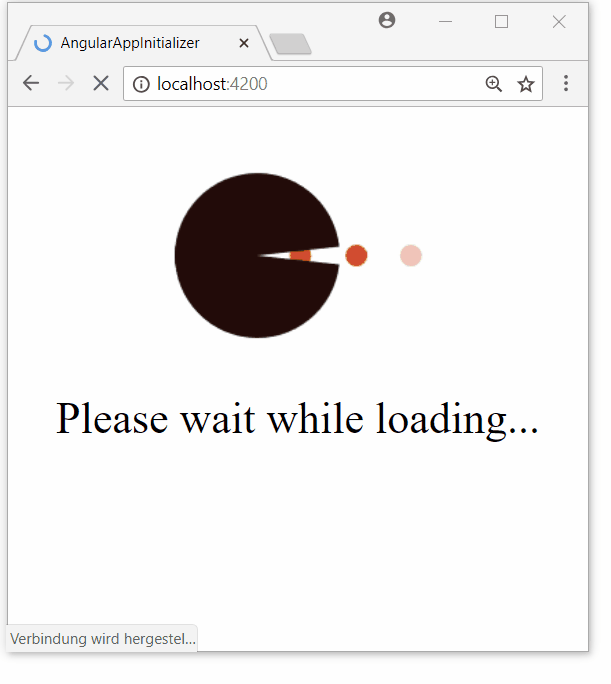

# angular app initializer

Demo-Projekt zum Blog Beitrag auf:

`https://javaeeblog.wordpress.com/`

> todo

## Run

Die Anwendung verwendet **Angular CLI**

run:

> npm start

open:

> http://localhost:4200/

_by GEDOPLAN, [Dominik Mathmann](https://github.com/dominikmathmann)_
